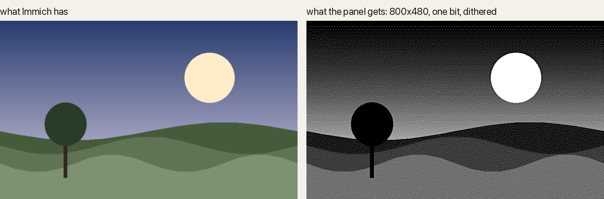
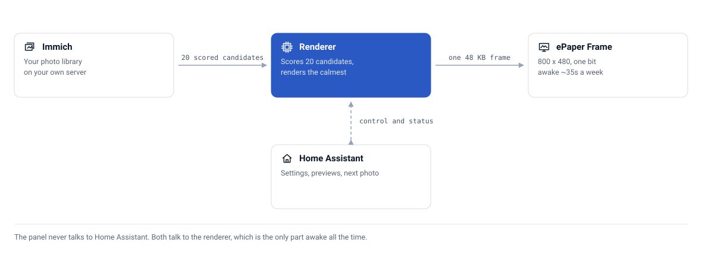
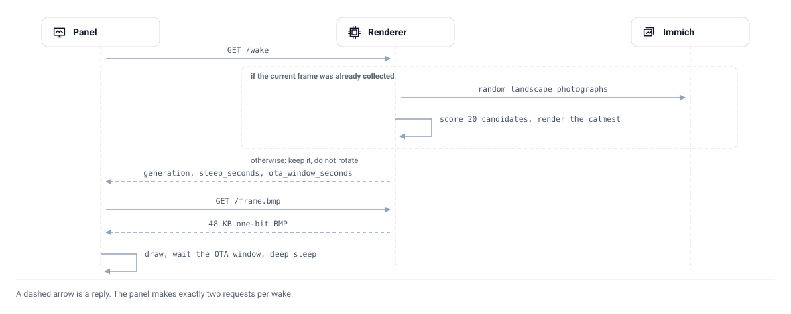

<div align="center">


# 🖼️ InkFrame for Immich

**A battery-powered 7.5" e-paper photo frame that shows one good photo a week from your own Immich library, managed from Home Assistant.**


[](https://hacs.xyz)
[](https://github.com/CaputoDavide93/InkFrame-Immich/releases)
[](https://github.com/CaputoDavide93/InkFrame-Immich/actions/workflows/ci.yml)

</div>

---

The panel is a Seeed Studio XIAO 7.5" ePaper Panel: an ESP32-C3 with no PSRAM and about 200 KB of heap, driving an 800x480 black-and-white display from a 2000 mAh cell. It cannot fetch, decode, scale or dither a photograph. So a small server does all of that and hands the panel a finished one-bit frame it only has to copy onto the glass. The panel wakes once a week, draws, and sleeps.

Three things decide whether a photo looks good on a one-bit panel, and none of them is the dithering algorithm. This project selects for all three before it renders anything. See [Rendering](docs/rendering.md).

<div align="center">

<br><sub>A synthetic scene through the real pipeline. The frames this was built on are family photographs, which stay at home.</sub>
</div>

---

## ✨ What's in here

| | Component | What it does |
|---|---|---|
| 🧠 | **Renderer** (`server/`) | Picks a landscape photograph from Immich, crops it to 800x480, tones and dithers it, and serves the frame as PNG, BMP or a raw framebuffer |
| 📟 | **Firmware** (`firmware/`) | ESPHome config for the XIAO panel: one wake a week, fetch, draw, sleep. Sleep interval and OTA window arrive from the server, so changing them needs no reflash |
| 🏠 | **Home Assistant integration** (`custom_components/inkframe/`) | One device: choose the source, tune the render, see the frame before the panel does, and know whether the panel collected it |

---

## 🗺️ Architecture

<picture>
  <source media="(prefers-color-scheme: dark)" srcset="docs/assets/architecture-dark.svg">
  
</picture>

The panel never talks to Home Assistant and Home Assistant never talks to the panel. Both talk to the renderer, which is awake all the time. A setting you change in Home Assistant is stored on the renderer and takes effect at the panel's next wake. The one entity that tells you whether a photo actually reached the glass is `On panel`; see [why that matters](docs/home-assistant.md#rendered-is-not-displayed).

The weekly wake, end to end:

<picture>
  <source media="(prefers-color-scheme: dark)" srcset="docs/assets/wake-sequence-dark.svg">
  
</picture>

Deeper: [Architecture](docs/architecture.md).

---

## 🚀 Quick Start

You need an Immich server, Home Assistant, Docker, and the panel.

**1. Create an Immich API key** with `asset.read`, `asset.view`, `asset.statistics`, `album.read` and `person.read`. Save it to a file readable by uid 1000:

```bash
mkdir -p ~/Secrets
printf '%s' 'YOUR_IMMICH_API_KEY' > ~/Secrets/immich_frame_api_key
chmod 644 ~/Secrets/immich_frame_api_key
# One shared bearer for the panel and Home Assistant. Keep it secret; it grants
# access to family-photo previews and renderer controls.
openssl rand -hex 32 > ~/Secrets/inkframe_token
chmod 644 ~/Secrets/inkframe_token
```

**2. Run the renderer:**

```bash
cd server
cp .env.example .env          # set IMMICH_URL, at least
docker compose up -d
curl -s -H "Authorization: Bearer $(cat ~/Secrets/inkframe_token)" http://localhost:8099/status
```

**3. Flash the panel.** Copy `firmware/secrets.yaml.example` to `firmware/secrets.yaml`, fill in Wi-Fi and keys, point `frame_server` at the renderer, then:

```bash
pip install esphome
esphome run firmware/immich-frame.yaml
```

**4. Add the integration.** In HACS, add `https://github.com/CaputoDavide93/InkFrame-Immich` as a custom repository (category *Integration*), install **InkFrame for Immich**, restart, then **Settings → Devices & Services → Add Integration → InkFrame for Immich** and enter the renderer URL and the same `inkframe_token` used by the panel.

[](https://my.home-assistant.io/redirect/hacs_repository/?owner=CaputoDavide93&repository=InkFrame-Immich&category=integration)

Without HACS: copy `custom_components/inkframe` into `<config>/custom_components/` and restart.

**Upgrading from an older release:** access is now authenticated. Create the
token file, add `inkframe_token` to ESPHome secrets, then use **Reconfigure**
on the existing InkFrame integration to enter that token before deploying the
protected renderer.

Full walkthroughs: [Hardware](docs/hardware.md) · [Firmware](docs/firmware.md) · [Wake and sleep](docs/wake-and-sleep.md) · [Home Assistant](docs/home-assistant.md) · [Operations](docs/operations.md) · [Releasing](docs/releasing.md). Every doc: [docs/README.md](docs/README.md).

---

## ⚙️ Configuration

Every knob has a sensible default. Home Assistant can change the ones marked ✅ at runtime; the value it sets is persisted and survives a redeploy.

<!-- AUTOGEN:settings -->
| Setting | Type | Range | Purpose | HA |
|---|---|---|---|---|
| `smooth` | float | 0.0 to 1.0 | Edge-preserving texture flattening before dithering | ✅ |
| `curve` | float | 0.0 to 1.0 | How hard tones are pushed away from mid-grey | ✅ |
| `edge` | int | 0 to 200 | Unsharp mask percent applied after smoothing | ✅ |
| `contrast` | float | 0.5 to 2.0 | Global contrast. Overlaps `curve`; not exposed in Home Assistant |  |
| `candidates` | int | 1 to 60 | Photos downloaded and scored per pick. Not exposed in Home Assistant |  |
| `max_busyness` | float | 1.0 to 100.0 | Reject anything scoring above this | ✅ |
| `require_camera` | bool | on / off | Only assets with a camera make in EXIF | ✅ |
| `landscape_only` | bool | on / off | Skip portraits. Off means they are cropped to fit, with the window placed on the faces Immich found | ✅ |
| `sleep_hours` | float | 1 to 336 | Delivered to the panel on `/wake` | ✅ |
| `ota_window_seconds` | int | 5 to 300 | Delivered to the panel on `/wake` | ✅ |
| `refresh_days` | int | 1 to 30 | How often the picture on the glass actually changes. Most wakes only CHECK (~7s); a draw is ~35s | ✅ |
| `refresh_hour` | int | 0 to 23 | Local hour for the scheduled draw. The first check at or after it, never an exact alarm | ✅ |
<!-- /AUTOGEN:settings -->

Environment variables set the defaults for a fresh install. The full list, generated from the code, is in [docs/api.md](docs/api.md#environment-variables).

---

## 📖 How it chooses a photo

| | Filter | Why it exists |
|---|---|---|
| 🔄 | **Landscape by orientation, not by dimensions** | Immich reports the stored EXIF width and height. Orientation values 5 to 8 transpose the image, so a photo stored 4032x3024 with `orientation: 6` renders portrait. On the library this was built against, `width > height` alone was wrong for 86% of photos |
| 📷 | **Taken by a camera** | `exifInfo.make` is set by every phone and camera and by nothing else. It keeps screenshots, memes and downloads off the wall without guessing at filenames |
| 🖼️ | **Portraits cropped, not skipped** | The panel is landscape. A portrait is cropped to 800x480 with the window placed on the faces Immich detected, so a close-up keeps its chin and a full-body shot keeps its body. Turn **Portraits** on to skip them instead |
| 🌾 | **Calm enough to dither** | Mean absolute Laplacian over the cropped frame. Grass and foliage score high and turn into speckle under any algorithm; a subject against a plain wall scores low and survives. The renderer scores twenty candidates and shows the calmest |

Sources you can choose from Home Assistant: **Random**, **Recent** (last N days), **Search** (a description, so the cat can reach the frame), **People** (any of the people you tick, not only photos with all of them), **Album**, or one named person. A person is offered only above a minimum number of landscape photographs, because a source that runs dry repeats itself.

---

## 📁 Repo structure

```text
InkFrame-Immich/
├── server/                     # 🧠 the renderer
│   ├── src/app.py              #    HTTP server, state, /wake protocol
│   ├── src/immich.py           #    Immich client, filters, render, pack
│   ├── tests/                  # 🧪 pytest
│   ├── Dockerfile
│   └── docker-compose.yml
├── firmware/
│   ├── immich-frame.yaml       # 📟 ESPHome config for the XIAO 7.5" panel
│   └── secrets.yaml.example
├── custom_components/
│   └── inkframe/               # 🏠 Home Assistant integration
├── .github/
│   ├── workflows/ci.yml        # ✅ tests, generated docs, hassfest, HACS, ESPHome
│   ├── ISSUE_TEMPLATE/         # 🐛 bug report, feature request
│   └── dependabot.yml
├── brand/                      # 🎨 icon and logo, drawn by tools/gen_brand.py
├── docs/                       # 📚 deep-dives, runbooks, the demo image (index: docs/README.md)
│   └── assets/                 # 🖼️ light/dark diagrams and the demo image
├── tools/
│   ├── gen_docs.py             # 🤖 regenerates the inventory tables
│   ├── gen_diagram.py          #    draws the docs/assets diagrams
│   └── gen_brand.py            #    regenerates brand/ and the demo
├── hacs.json                   # 🏠 HACS metadata
├── CHANGELOG.md
├── CONTRIBUTING.md
├── SECURITY.md
└── LICENSE
```

---

## 🧪 Testing

```bash
cd server
pip install -r requirements.txt pytest
python -m pytest tests -q
python ../tools/gen_docs.py --check     # inventory tables in sync with the code
```

The tests pin the parts that are easy to get wrong and hard to notice: the orientation rule against the shapes seen in a real library, the framebuffer's size and polarity, the busyness score's independence from input resolution, and that every module the server imports is copied into the image.

---

## 🛠️ Troubleshooting

The two that catch everyone: a panel that is asleep looks identical to a dead one, and a photo the panel never fetched looks identical to one on the wall. Both, and the rest, in [Troubleshooting](docs/troubleshooting.md).

---

## 🔒 Security

The renderer holds an Immich API key and serves your photographs, unauthenticated, to anything on its network. Read [SECURITY.md](SECURITY.md) before exposing it beyond a trusted LAN.

---

## 🤝 Contributing

See [CONTRIBUTING.md](CONTRIBUTING.md). Issues and pull requests are welcome, in particular for other e-paper panels and other photo servers.

---

## 📄 License

MIT. See [LICENSE](LICENSE). Changes are recorded in [CHANGELOG.md](CHANGELOG.md).

---

<p align="center">
  <sub>⭐ If this project helped you, please give it a star! ⭐</sub>
  <br>
  <sub>Made with ❤️ by <a href="https://github.com/CaputoDavide93">Davide Caputo</a></sub>
</p>
