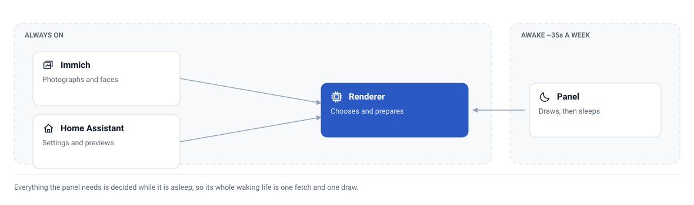
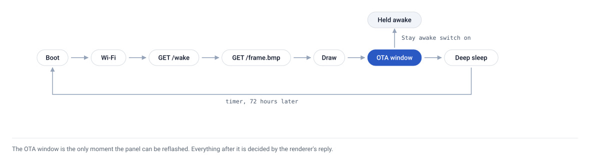

# 🗺️ Architecture

Three parts, one of which is asleep almost all the time.

<picture>
  <source media="(prefers-color-scheme: dark)" srcset="assets/topology-dark.svg">
  
</picture>

## Why the renderer exists

The XIAO ESP32-C3 has no PSRAM. After Wi-Fi and the display's own 48 KB buffer, about 200 KB of heap remains, and the largest contiguous block measured on a running panel was 20 KB. That rules out decoding a JPEG, scaling it, or dithering it on the device.

So the renderer does every expensive step and serves a frame that is already exactly 800x480 and already one bit per pixel. The panel's ESPHome `online_image` component decodes a BMP into its single image buffer and the display copies it out. That buffer is allocated once at first fetch and kept for the life of the boot; a second allocation after the heap has fragmented is the failure mode reported for this board, so the firmware never asks for one.

## Why the panel talks to the renderer and not to Home Assistant

The panel sleeps for all but about 35 seconds a week. Home Assistant cannot push to a device that has no network stack, and a device that polls Home Assistant would need Home Assistant's API to hold everything about photo selection. The renderer is the one always-on component that knows the library, so both the panel and Home Assistant talk to it.

## The wake protocol

<picture>
  <source media="(prefers-color-scheme: dark)" srcset="assets/wake-states-dark.svg">
  
</picture>

`/wake` does two things in one call.

**It decides whether to rotate.** The renderer tracks which generation the panel last fetched. If the current frame has already been collected, `/wake` renders a new one. If Home Assistant rendered a frame yesterday and the panel has not seen it yet, `/wake` serves that frame instead of making another. Without this rule, pressing **Next photo** the day before a wake would be undone by the wake itself.

**It carries the wake parameters.** `sleep_seconds` and `ota_window_seconds` come back in the reply. The firmware uses them for this wake's OTA window and this sleep's duration. They started life as firmware substitutions; moving them to the server means changing them from Home Assistant needs no reflash. The firmware keeps its own values only as a fallback for a wake where `/wake` is unreachable.

## Generations

Every render increments a generation counter. The renderer keeps the current generation and the one before it. A panel that started fetching generation 4 as generation 5 landed keeps reading 4, so a rotation can never paste the top of one photo onto the bottom of another. `/status` reports `generation`, `panel_fetched_generation` and `on_panel`, which is true only when they match.

## Rendered is not displayed

E-paper holds its last image with no power. A frame the panel never collected looks exactly like a frame hanging on the wall. The renderer records the moment the panel fetches `/frame.*`, and exposes it as `on_panel`; Home Assistant's `/preview.png` is deliberately a different path so opening the dashboard cannot mark a photo as displayed. Every entity in the integration describes the renderer except `On panel`, which describes the glass.

## Memory budget on the panel

Measured on the running device, not estimated:

| | Bytes |
|---|---|
| Display buffer (800x480 / 8) | 48,000 |
| `online_image` decode buffer | 48,000 |
| Free heap after both | ~43,000 |
| Largest free block after both | 20,480 |

The receive buffer for HTTP is kept at 4 KB for the same reason. A 48 KB BMP arrives in about 4.3 seconds; the PNG it replaced was 12% smaller and took 5.2 seconds, because the panel spent the difference in the inflate pass.
