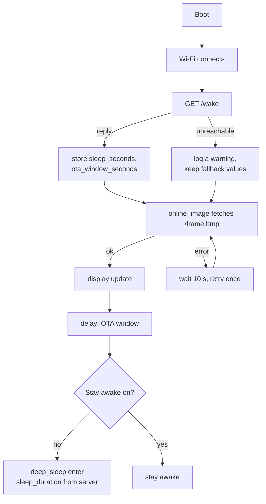

# 📟 Firmware

`firmware/immich-frame.yaml` is a single ESPHome configuration. This page explains the decisions in it; the file's own comments explain each line.

## What a wake does



**The fetch fires on `wifi.on_connect`, not a fixed boot delay.** The only thing it needs is an IP address. A fixed delay long enough to be safe was twelve seconds of dead waiting on every wake.

**One retry.** A fetch that fails leaves last week's photo on the glass, which looks exactly like success, and nothing would try again for a week. So the firmware retries once inside the wake window.

**`run_duration` is a backstop, not a target.** It is set to 120 seconds so that a wake whose fetch fails twice still sleeps instead of sitting awake flattening the cell. The normal path sleeps at about 35 seconds.

## Sleep interval and OTA window come from the server

Both used to be substitutions in this file, which meant a reflash to change either. They now arrive in the `/wake` reply and are stored in two globals; the `delay` before sleep and the `sleep_duration` passed to `deep_sleep.enter` read those globals. The substitutions `sleep_fallback_s` and `ota_window_fallback_s` are used only when a global is still zero, meaning `/wake` never answered this boot.

Set them from Home Assistant as **Sleep interval** and **OTA window**. A change takes effect from the wake after next: the panel learns the new values at its next wake and applies them to that wake's window and the sleep that follows.

## The Stay awake switch

A flash-backed template switch. While it is on, the panel does not sleep. It is the only way to get more than one OTA window a week, and you turn it on from Home Assistant during a wake window.

The guard around `deep_sleep.enter` is load-bearing:

```yaml
- if:
    condition:
      switch.is_off: stay_awake
    then:
      - deep_sleep.enter: ...
```

`deep_sleep.prevent` only suppresses the automatic sleep at `run_duration` expiry. It does **not** block an explicit `deep_sleep.enter`. The first version of this firmware assumed it did, and the assumption put the panel into a 168-hour sleep with the switch on and only the reset button able to recover it.

## Why BMP

The renderer offers the frame as PNG, BMP and raw framebuffer. The firmware fetches BMP. A one-bit PNG of dithered noise is only about 9% smaller than the raw 48 KB, and the panel pays for that 9% with an inflate pass and a per-scanline unfilter on a 160 MHz core. Measured on the device: PNG 5.2 seconds, BMP 4.3 seconds, for 12% more bytes.

## Memory

The `online_image` decode buffer (48 KB) is allocated on the first fetch of a boot and kept. The firmware never creates a second image, never changes the image size, and keeps `buffer_size` at 4 KB, because a second large allocation after Wi-Fi has fragmented the heap is the failure reported for this board. Two sensors, **Heap free** and **Heap largest block**, are exposed so a regression shows up as a number rather than as a panel that stopped changing.

## Flashing

First flash is over USB-C:

```bash
pip install esphome
cp firmware/secrets.yaml.example firmware/secrets.yaml   # fill it in
esphome run firmware/immich-frame.yaml
```

Every later flash can be over the air, but only while the panel is awake. Either catch a wake window, or turn **Stay awake** on during one and flash at leisure:

```bash
esphome run firmware/immich-frame.yaml --device <panel-ip>
```

A small loop that watches for the panel and uploads the moment it appears saves a lot of waiting; see [Troubleshooting](troubleshooting.md#the-panel-is-asleep-and-i-need-it-now).

## Entities the panel itself exposes

These come from ESPHome, not from the `inkframe` integration, and are only reachable while the panel is awake:

| Entity | Purpose |
|---|---|
| `switch` Stay awake | Hold the panel awake for maintenance |
| `button` Next photo | Refetch whatever the renderer currently has |
| `button` Restart | Reboot |
| `sensor` Heap free, Heap largest block | Memory headroom, see above |
| `sensor` WiFi signal, SSID, IP address | Diagnostics |
