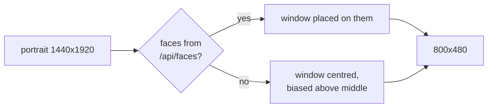
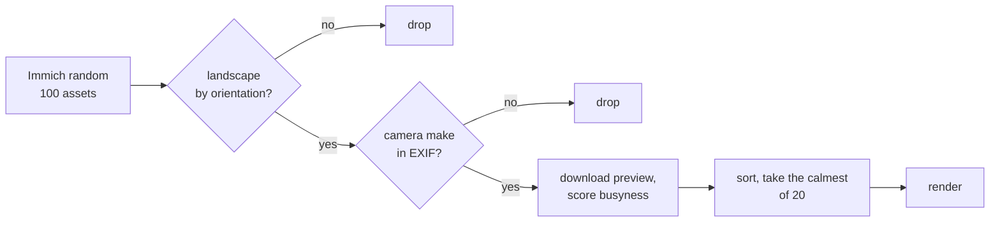

# 🎨 Rendering

A one-bit 800x480 panel at about 133 DPI can show a good photograph. It cannot show every photograph. This page is about choosing well and then not ruining the choice.

## Portraits, and the panel's shape

The panel is landscape. A 3:4 portrait scaled to fit its height uses 45% of the
glass, so for a long time portraits were simply skipped. They are not any more:
the renderer crops an 800x480 window out of them and places it on the faces
Immich has already detected.



Where the face sits vertically depends on how much of the window it fills:

| Face fills | Placed | Why |
|---|---|---|
| under 35% | a third down | a full-body or group shot; leaves room for the body |
| 35% to 70% | slides between | so a mid-sized face does not jump between two rules |
| over 70% | centred | a close-up; thirding it pushes the chin out of frame |

That ramp is not decoration. Thirding was the only rule at first, and on a real
close-up it cut the chin off.

Two more properties the tests pin, both learned the same way:

- **The window never leaves the image.** A face near an edge would otherwise
  produce a negative offset, which renders as a black band.
- **Face boxes are scaled from the original to the rendition.** Immich reports
  boxes against the full-size asset and `imageWidth`/`imageHeight` alongside
  them; the renderer works on a preview. Ignoring the scale crops the wrong
  part of the photo entirely.

Cropping needs the `face.read` permission on the API key. Without it the boxes
come back empty, the crop falls back to centred, and nothing breaks.

Set `landscape_only` (**Portraits** in Home Assistant) to keep skipping them.

---

## Three filters, then a score



### Landscape by orientation

Applied only while `landscape_only` is on. With portraits cropped it is off,
and this filter does nothing.

Immich reports `exifImageWidth` and `exifImageHeight` as stored in the file. EXIF orientation values 5, 6, 7 and 8 rotate the image by 90 degrees on display, so a photo stored 4032x3024 with `orientation: 6` is a portrait. The rule is

```
landscape = (width > height) XOR (orientation in {5, 6, 7, 8})
```

On the library this was built against, twelve of fourteen sampled photos were stored landscape and rendered portrait. A `width > height` filter would have hung them sideways. The rule was verified against Immich's own orientation-corrected thumbnails, fourteen for fourteen, and `tests/test_orientation.py` pins every shape.

When EXIF cannot answer, `is_landscape()` returns `None` and the asset is skipped. Returning `False` would silently drop photos with incomplete EXIF; returning `True` would hang them sideways. Neither is the function's call to make.

### Taken by a camera

`exifInfo.make` is populated by every phone and camera and by nothing else. Its absence identifies screenshots, memes, receipts and downloads without guessing at filenames. It rejects about 8% of otherwise-eligible assets.

This filter earns its place because the busyness score alone promotes exactly the wrong images. In the first sample the single cleanest-dithering asset was a meme: flat graphics score well on texture by having none.

### Busyness

Mean absolute Laplacian over the cropped, greyscale 800x480 frame. Fine texture everywhere, grass, foliage, gravel, scores high and collapses into visible dot noise under every dithering algorithm tried: Floyd-Steinberg, ordered Bayer, clustered-dot halftone, with and without tone curves. A subject against a plain background scores low and survives all of them.

Measured range on a real library: 2.7 to 59.5. The default threshold `MAX_BUSYNESS` is 22. The renderer downloads and scores twenty candidates and shows the calmest; if every one is above the threshold it still shows the calmest and says so in `/status`, because a speckly photo beats last week's photo left up for ever.

The score is resolution-independent within about 50%, which `tests/test_frame.py` checks, so Immich's varying preview sizes do not move the threshold. Do not change the scoring resolution to save time: the threshold is calibrated against 800x480 scores and would silently recalibrate.

## The treatment

Order matters.

1. **Crop** to 800x480, centred slightly above the middle. Faces and horizons both sit high.
2. **Autocontrast** with a 1% cutoff.
3. **Smooth texture while keeping edges.** The frame is blended toward a Gaussian blur only where local variance is low. Busy-but-featureless regions flatten; real boundaries stay.
4. **Push tones off mid-grey** with a sine S-curve. Dot density, and so visible noise, peaks at 50% grey. Trading tonal subtlety the panel cannot render for cleaner flat areas is a good trade.
5. **Restore edges** with an unsharp mask, radius 3, threshold 6.
6. **Dither** with Floyd-Steinberg to one bit.

An earlier version sharpened before any smoothing. That turned grass into a field of specks, which is the complaint that produced this page. Sharpening after dithering only amplifies dither noise, so it has to sit between the smooth and the dither.

The knobs, all runtime-settable from Home Assistant: `smooth` (blend strength, 0 to 1), `curve` (S-curve amount, 0 to 1), `edge` (unsharp percent, 0 to 200). `contrast` exists on the renderer but is not exposed because it overlaps the curve.

## The output

`pack()` turns PIL's mode-1 image into a packed, MSB-first framebuffer where a set bit means ink. PIL stores 255 for white, so every bit is inverted with a 256-entry translation table; the Python-level loop it replaced took 1.8 ms, the table 0.15 ms. The result is exactly 48,000 bytes and `tests/test_frame.py` refuses anything else, because a short buffer draws as garbage rather than failing.

From that buffer the renderer produces, once per generation and cached:

| Format | Size | Use |
|---|---|---|
| BMP, 1-bit, bottom-up rows | 48,062 B | What the panel fetches. Decodes as a copy |
| PNG, 1-bit | ~43,000 B | Home Assistant's preview |
| Raw framebuffer, strip-fetchable | 48,000 B | Escape hatch for a panel with no decoder or no room for one |

Dithered noise does not compress. PNG saves about 9% and costs an inflate pass; on the panel that was a second slower.
